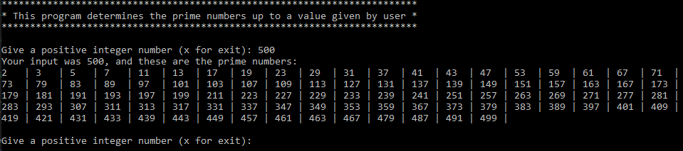

## Calculation of prime numbers
**********************************************
Software:		    C# version 9.0 Console application

Framework:          .NET 5.0

Solution Version:   1.0

Date: 			    March 14, 2021

Author:			    Dirk Mueller
**********************************************

Software for the calculation of a prime number given by the user. An example output looks like this:

*Fig 1: Excerpt of code showing the output* 